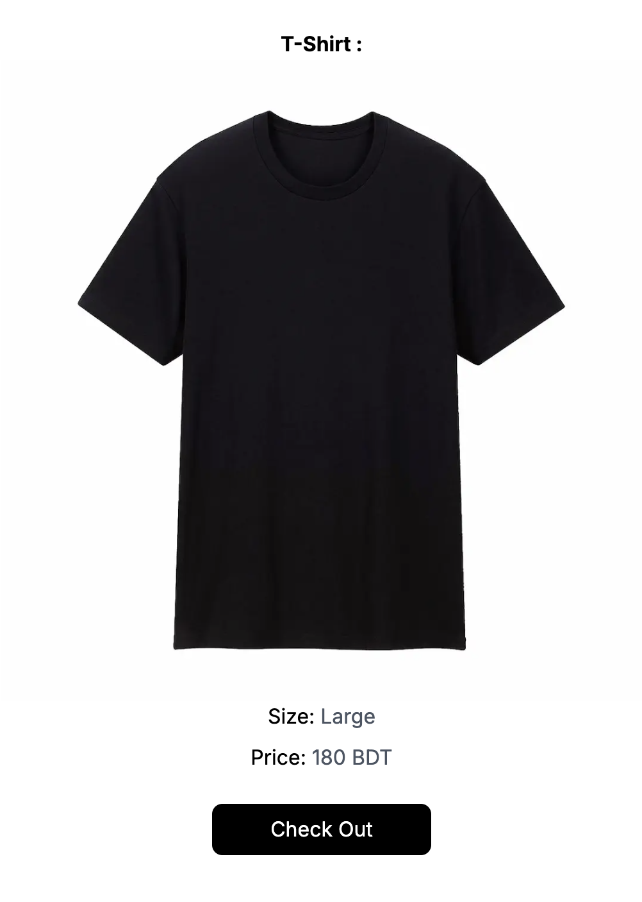

# NextJS Payment Gateway 

This app shows how easy it is to set up a payment gateway using Next.js and the SSLCOMMERZ API. With 37 payment options and clear instructions, SSLCOMMERZ makes the process simple and secure. Use Next.js and SSLcommerz together to build a reliable and efficient payment system.
<p align="center">
  
  
  
</p>

## Features
<div align="center">

| Feature                      | Description                                   |
|------------------------------|-----------------------------------------------|
| **NextJS Environment** | Easily interact with frontend & backend architecture.       |
| **SSLCOMMERZ API**                    | SSLCOMMERZ provides a well-structured guideline .|
| **37 Payment Options**               | In the application you can find 37 different payment options.|
  
</div>

## Technologies
- Next.js
- Node.js
- Tailwind CSS
- SSLCOMMERZ API (test)
- Sandbox API (test)
  

## Installation
### Prerequisites
- Node.js
- npm or yarn

### Steps

1. Clone the repository
    ```bash
    git clone https://github.com/Siratul804/Payment-Gateway-NextJS.git
    ```
2. Navigate to the project directory
    ```bash
    cd your-repo
    ```
3. Install dependencies
    ```bash
    npm install
    ```
4. Run App
    ```bash
    npm run dev
    ```
## Payment Route 

```bash
  import { NextResponse } from "next/server";

  export async function POST() {
  try {
    const tran_id = Math.floor(100000 + Math.random() * 900000).toString();
    const init_url = "https://sandbox.sslcommerz.com/gwprocess/v4/api.php";

    const formData = new FormData();
    formData.append("store_id", "testbox");
    formData.append("store_passwd", "qwerty");
    //
    formData.append("total_amount", "180");
    formData.append("currency", "BDT");
    //
    formData.append("tran_id", `${tran_id}`);
    formData.append(
      "success_url",
      `http://localhost:3000/api/success?id=${tran_id}`
    );
    formData.append("fail_url", `http://localhost:3000/api/fail?id=${tran_id}`);
    formData.append(
      "cancel_url",
      `http://localhost:3000/api/cancel?id=${tran_id}`
    );
    formData.append("ipn_url", `http://localhost:3000/api/ipn?id=${tran_id}`);
    //
    formData.append("cus_name", "Siratul Islam");
    formData.append("cus_email", "islamsiratul@gmail.com");
    formData.append("cus_add1", "Mipur 1 Dhaka 1216");
    formData.append("cus_add2", "Mipur 2 Dhaka 1216");
    formData.append("cus_city", "Dhaka");
    formData.append("cus_state", "Dhaka");
    formData.append("cus_postcode", "1216");
    formData.append("cus_country", "Bangladesh");
    formData.append("cus_phone", "01916304123");
    formData.append("cus_fax", "01916304123");
    formData.append("shipping_method", "YES");
    formData.append("ship_name", "Siratul Islam");
    formData.append("ship_add1", "Mipur 1 Dhaka 1216");
    formData.append("ship_add2", "Mipur 1 Dhaka 1216");
    formData.append("ship_city", "Dhaka");
    formData.append("ship_state", "Dhaka");
    formData.append("ship_country", "Bangladesh");
    formData.append("ship_postcode", "1216");
    //
    //
    formData.append("product_name", "T-Shirt");
    formData.append("product_category", "category");
    formData.append("product_profile", "profile");
    formData.append("product_amount", "1");
    //

    const requestOptions = { method: "POST", body: formData };
    let SSLRes = await fetch(init_url, requestOptions);

    let SSLResJSON = await SSLRes.json();

    return NextResponse.json({ data: SSLResJSON });
  } catch (e) {
    return NextResponse.json({ data: e });
  }
}
```


<p align="center">
<b>Made with ❤️ by   <a href="https://github.com/Siratul804">  Siratul Islam </a> </b> 
</p>

<p align="center">
  <a href="https://github.com/Siratul804?tab=repositories">View Project</a> •
  <a href="https://github.com/Siratul804">GitHub Profile</a> •
  <a href="https://www.linkedin.com/in/siratulislam/">LinkedIn</a> •
  <a href="https://x.com/Siratul074">Twitter</a>
</p>

<p align="center">
  <small>© 2024 Siratul Islam. All rights reserved.</small>
</p>

