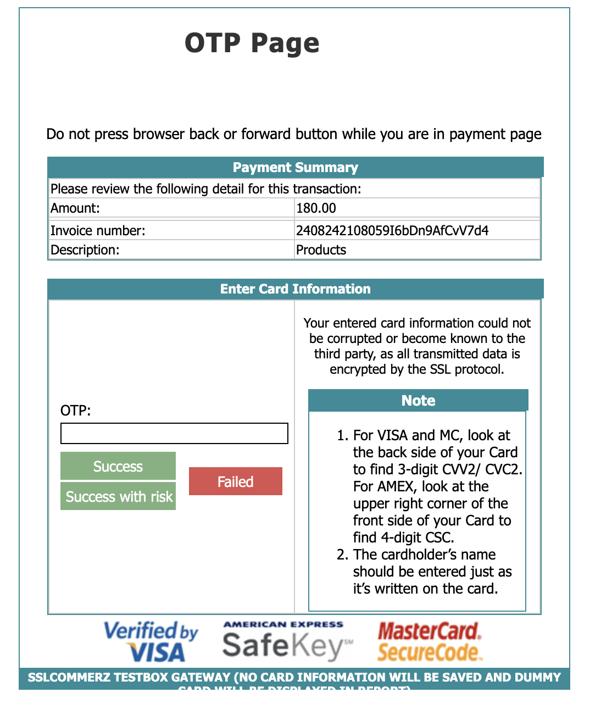

# NextJS Payment Gateway 

This app shows how easy it is to set up a payment gateway using Next.js and the SSLCOMMERZ API. With 37 payment options and clear instructions, SSLCOMMERZ makes the process simple and secure. Use Next.js and SSLcommerz together to build a reliable and efficient payment system.
<p align="center">
  
  
  
</p>

## Features
<div align="center">

| Feature                      | Description                                   |
|------------------------------|-----------------------------------------------|
| **NextJS Environment** | Easily interact with frontend & backend architecture.       |
| **SSLCOMMERZ API**                    | SSLCOMMERZ provides a well-structured guideline .|
| **37 Payment Options**               | In the application you can find 37 different payment options.|
  
</div>

## Technologies
- Next.js
- Node.js
- Tailwind CSS
- SSLCOMMERZ API (test)
- Sandbox API (test)
  

## Installation
### Prerequisites
- Node.js
- npm or yarn

### Steps

1. Clone the repository
    ```bash
    git clone https://github.com/Siratul804/Payment-Gateway-NextJS.git
    ```
2. Navigate to the project directory
    ```bash
    cd your-repo
    ```
3. Install dependencies
    ```bash
    npm install
    ```
4. Run App
    ```bash
    npm run dev
    ```

<p align="center">
<b>Made with ❤️ by   <a href="https://github.com/Siratul804">  Siratul Islam </a> </b> 
</p>

<p align="center">
  <a href="https://github.com/Siratul804?tab=repositories">View Project</a> •
  <a href="https://github.com/Siratul804">GitHub Profile</a> •
  <a href="https://www.linkedin.com/in/siratulislam/">LinkedIn</a> •
  <a href="https://x.com/Siratul074">Twitter</a>
</p>

<p align="center">
  <small>© 2024 Siratul Islam. All rights reserved.</small>
</p>

